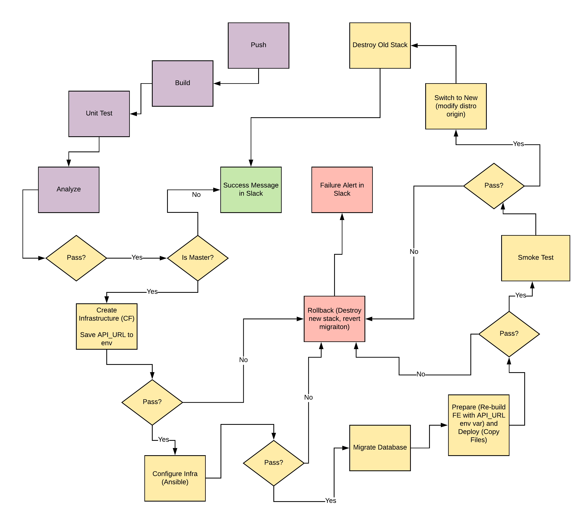

## Give your Application Auto-Deploy Superpowers
In this project, you will prove your mastery of the following learning objectives:
- Explain the fundamentals and benefits of CI/CD to achieve, build, and deploy automation for cloud-based software products.
- Utilize Deployment Strategies to design and build CI/CD pipelines that support Continuous Delivery processes.
- Utilize a configuration management tool to accomplish deployment to cloud-based servers.
- Surface critical server errors for diagnosis using centralized structured logging.

### Built With

- [Circle CI](www.circleci.com) - Cloud-based CI/CD service
- [Amazon AWS](https://aws.amazon.com/) - Cloud services
- [AWS CLI](https://aws.amazon.com/cli/) - Command-line tool for AWS
- [CloudFormation](https://aws.amazon.com/cloudformation/) - Infrastrcuture as code
- [Ansible](https://www.ansible.com/) - Configuration management tool
- [Prometheus](https://prometheus.io/) - Monitoring tool

### Project Submission
####  1: Selling CI/CD to your Team/Organization
|CRITERIA|MEETS SPECIFICATIONS |Files |
|:-----|:-----|:-----|
|Explain the fundamentals and benefits of CI/CD to achieve, build, and deploy automation for cloud-based software products.|The CI/CD benefits proposal contains essential benefits of CI/CD, and describes the business context that will benefit from the automation tools. Explanation should include benefits that translate to revenue and cost for the business.|[presentation.pdf](./presentation.pdf)|

#### Section 2: Deploying Working, Trustworthy Software
|CRITERIA|MEETS SPECIFICATIONS |Files |
|:-----|:-----|:-----|
|Utilize Deployment Strategies to design and build CI/CD pipelines that support Continuous Delivery processes.|A public git repository with your project code. |[URL01](https://github.com/nhothuy48cb/app-auto-deploy-superpowers/) https://github.com/nhothuy48cb/app-auto-deploy-superpowers/|
||***Console output of various pre-deploy job failure scenarios:***||
||Build Jobs that failed because of compile errors. |[SCREENSHOT01](./screenshots/SCREENSHOT01.png)|
||Failed unit tests. |[SCREENSHOT02](./screenshots/SCREENSHOT02.png)|
||Failure because of vulnerable packages. |[SCREENSHOT03](./screenshots/SCREENSHOT03.png)|
||An alert from one of your failed builds. ||
||***Evidence in your code that:*** Compile errors have been fixed. Unit tests have been fixed. All critical security vulnerabilities caught by the “Analyze” job have been fixed|[.circleci](./.circleci) [backend](./backend) [frontend](./frontend)|
|Utilize a configuration management tool to accomplish deployment to cloud-based servers.|Console output of appropriate failure for infrastructure creation job (using CloudFormation). |[SCREENSHOT05](./screenshots/SCREENSHOT05.jpg)|
||Console output of a smoke test job that is failing appropriately. |[SCREENSHOT06](./screenshots/SCREENSHOT06.png)|
||Console output of a successful rollback after a failed smoke test. |[SCREENSHOT07](./screenshots/SCREENSHOT07.png)|
||Console output of successful promotion of new version to production in CloudFront. |[SCREENSHOT08](./screenshots/SCREENSHOT08.png)|
||Console output of successful cleanup job that removes old S3 bucket and EC2 instance. |[SCREENSHOT09](./screenshots/SCREENSHOT09.png)|
||Evidence that the deploy jobs only happen on the `master` branch. |[SCREENSHOT10](./screenshots/SCREENSHOT10.png)|
||Evidence of deployed and functioning front-end application in an S3 bucket .||
||Evidence of deployed and functioning front-end application in CloudFront. ||
||Evidence of healthy back-end application. ||
#### Section 3: Turn Errors into Sirens
|CRITERIA|MEETS SPECIFICATIONS |Files |
|:-----|:-----|:-----|
|Surface critical server errors for diagnosis using centralized logging.|Evidence of Prometheus Server. ||
||Evidence that Prometheus is monitoring memory, cpu and disk usage of EC2 instances. ||
||Evidence that Prometheus and AlertManager send alerts when certain conditions exist in the EC2 instance. |[SCREENSHOT12](./screenshots/SCREENSHOT12.png)|
### License
[License](LICENSE.md)