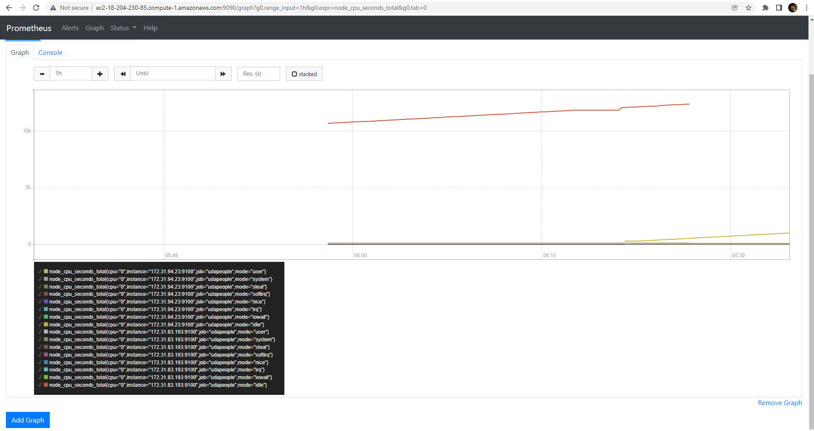
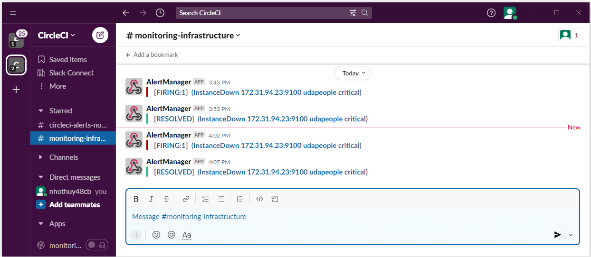
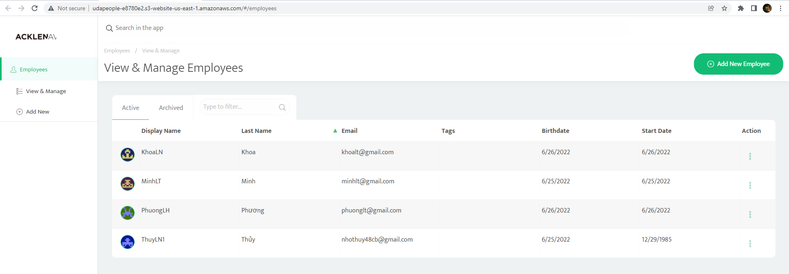
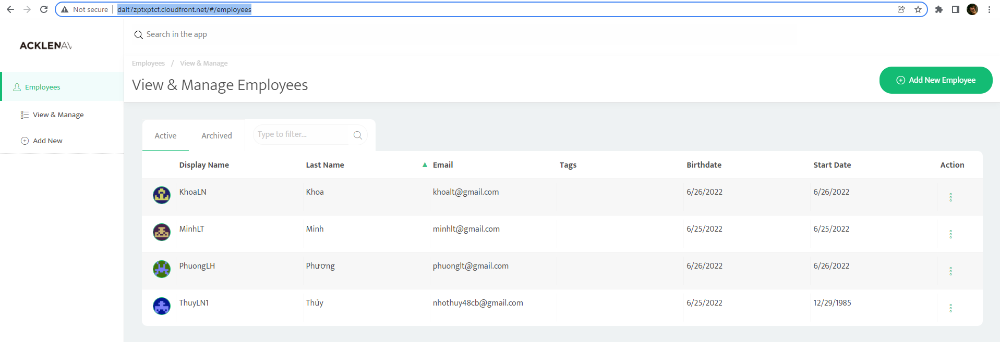

# Project Solution Screenshots

## [SCREENSHOT01 ](./SCREENSHOT01.png)
 

## [SCREENSHOT02](./SCREENSHOT02.png)
  

## [SCREENSHOT03](./SCREENSHOT03.png)
  

## [SCREENSHOT04](./SCREENSHOT04.jpg) e-mail-Notification

## [SCREENSHOT04](./SCREENSHOT04.png) slack-Notification

  
## [SCREENSHOT05](./SCREENSHOT05.png)
  
  
## [SCREENSHOT06](./SCREENSHOT06.png)
  
  
## [SCREENSHOT07](./SCREENSHOT07.png)
  
  
## [SCREENSHOT08](./SCREENSHOT08.png)
  
  
## [SCREENSHOT09](./SCREENSHOT09.png)
  
  
## [SCREENSHOT10](./SCREENSHOT10.png)
  
  
## [SCREENSHOT11_cpu.png](./SCREENSHOT11_cpu.png)
  

## [SCREENSHOT11_cpu.png](./SCREENSHOT11_cpu.png)
  
  
## [SCREENSHOT11_disk.png](./SCREENSHOT11_disk.png)
  

## [SCREENSHOT11_memory.png](./SCREENSHOT11_memory.png)
  
    
## [SCREENSHOT12](./SCREENSHOT12.png)
  
  
## [SCREENSHOT__service-discovery](./SCREENSHOT__service-discovery.png)
   

# URL SCREENSHOTS
## [URL02_SCREENSHOT.png](./URL02_SCREENSHOT.png)
   
## [URL03_SCREENSHOT_01.png](./URL03_SCREENSHOT_01.png)
   
## [URL03_SCREENSHOT_02.png](./URL03_SCREENSHOT_02.png)
   
## [URL04_SCREENSHOT.png](./URL04_SCREENSHOT.png)
   
